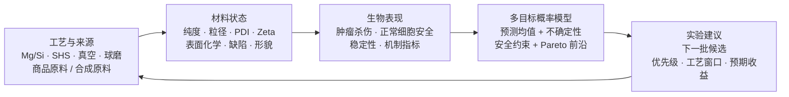
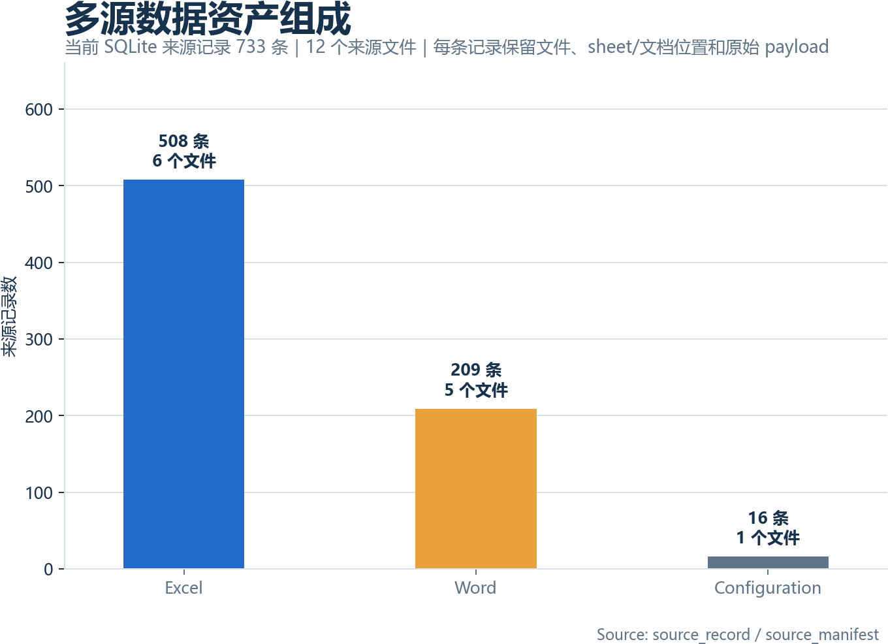
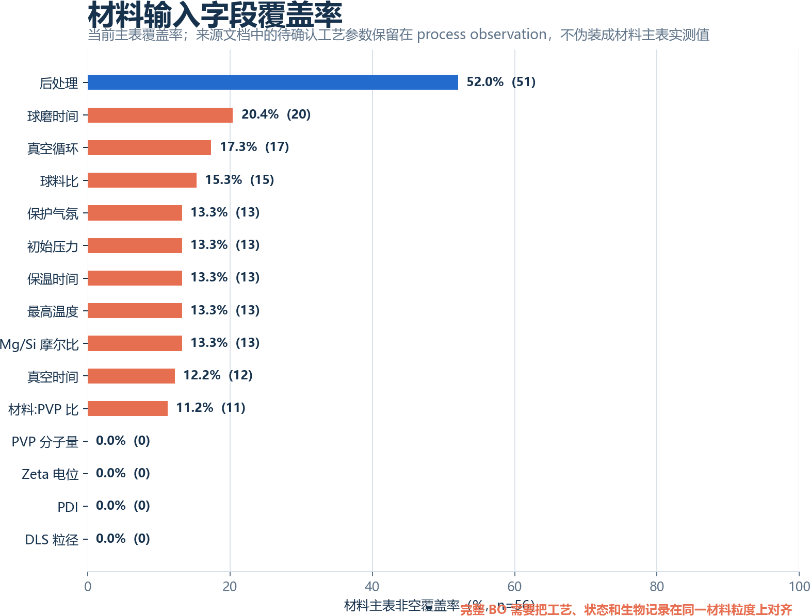
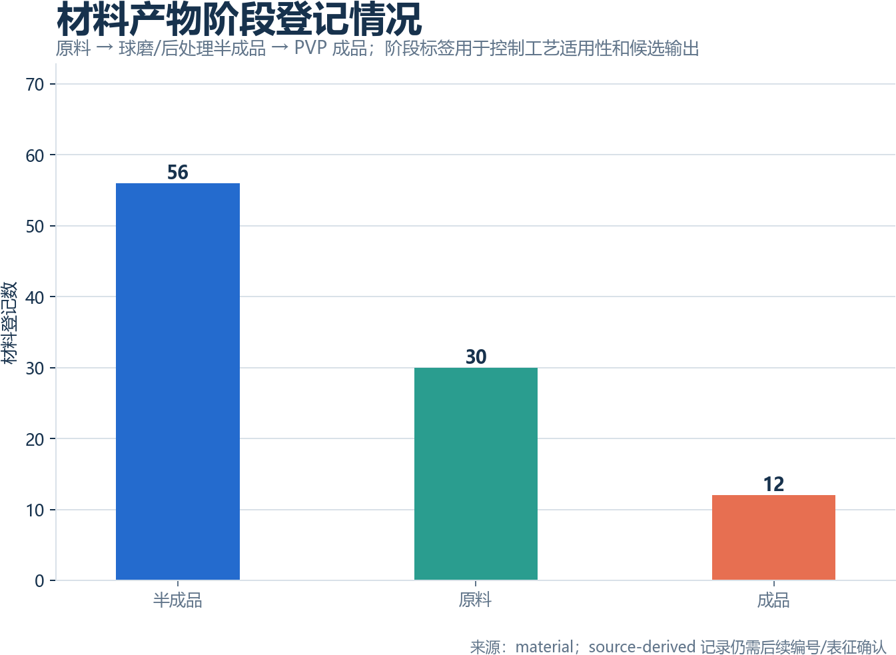
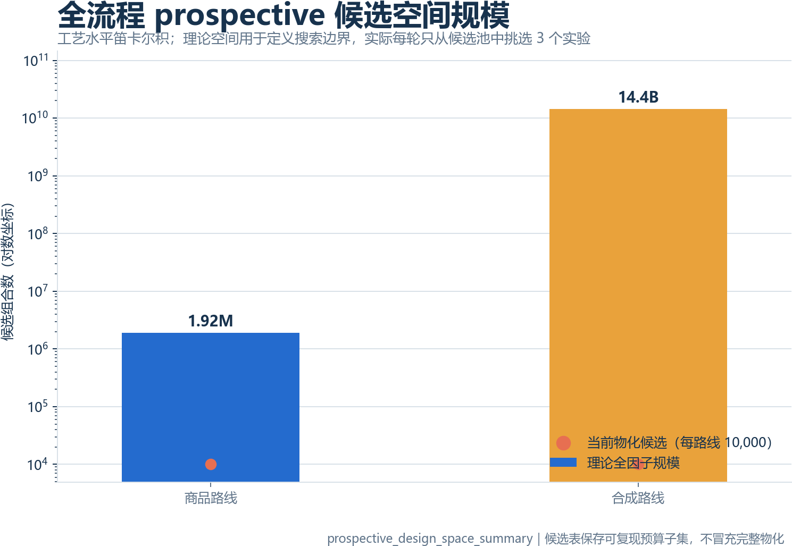
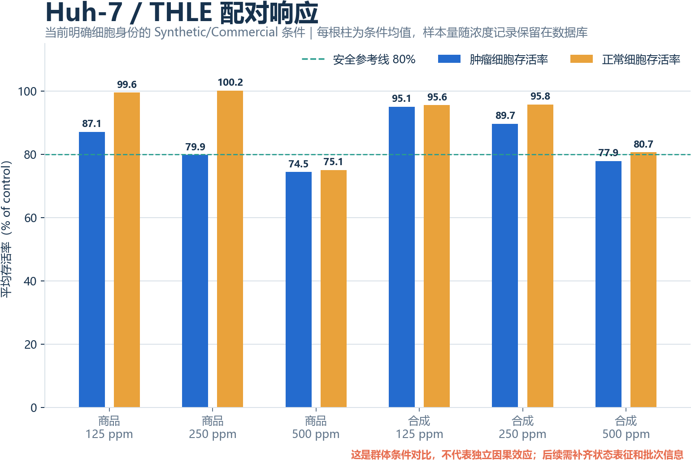
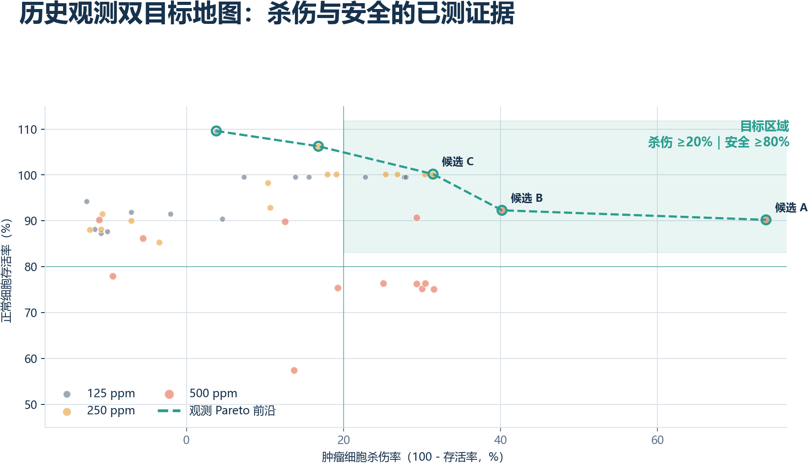
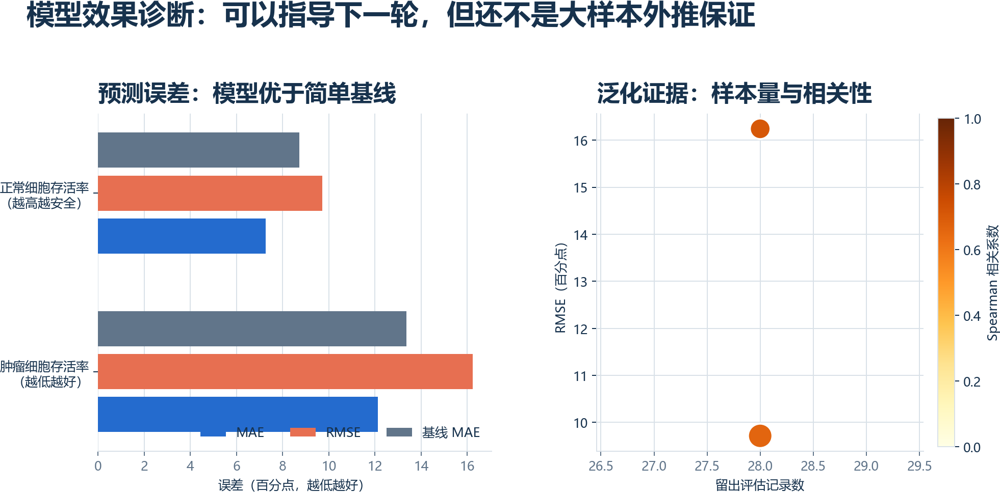
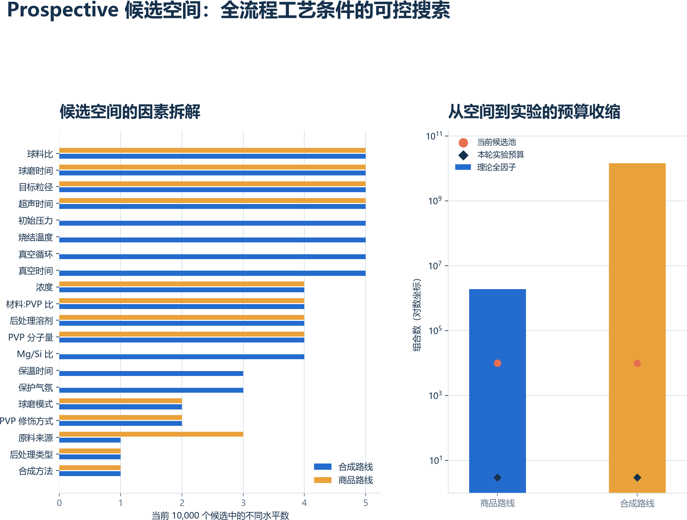

# Mg2Si 材料中心智能设计平台

> 从“做出一个材料、分别测性能”升级为“以目标生物学性能反推材料状态与可制造工艺”。

**项目定位**：面向 Mg2Si 材料的材料信息学与主动学习平台。平台把合成记录、材料表征、细胞学安全性与杀伤数据整合为可追溯数据库，并以多目标贝叶斯优化为核心，在全流程候选空间中每轮挑选约 3 个最值得验证的实验组合。

**本次汇报希望回答的问题**：我们是否已经拥有一条可信的路径，能够从有限实验数据中逐步回答“材料应该做到什么状态、工艺应如何调、下一轮实验最值得做什么”？

---

## 1. 为什么要做：材料研发不应只靠逐批试错

Mg2Si 材料的研发天然跨越三个环节：

1. **制备**：Mg/Si 配比、SHS 温度、真空与保护气氛、保温时间、球磨、分散和表面修饰共同决定材料状态。
2. **材料状态**：纯度、粒径、PDI、Zeta 电位、表面氧化、缺陷和形貌决定材料在介质中的真实行为。
3. **生物效果**：最终同时表现为肿瘤细胞杀伤、正常细胞安全性、稳定性及后续机制读出。

传统路径通常是“改一个参数、做一批材料、测一次细胞”。问题在于：实验记录被分散在多个表格中，材料批次与细胞数据难以一一追溯，失败实验也无法转化为下一轮设计规则。即使观察到一个候选表现较好，也很难回答它究竟是由粒径、表面状态、配比还是制备历史造成的。

本项目的目标不是用模型替代实验，而是建立一个会随着实验持续学习的决策系统：

> **目标生物性能 → 目标材料状态 → 可制造工艺窗口 → 下一轮最有信息量的实验。**

---

## 2. 最终交付：系统应当输出什么

对一个明确的研发目标，例如“在 Huh-7 中提高杀伤、同时保持 THLE 安全性”，平台最终输出四类结果：

| 输出 | 要回答的问题 | 示例形式 |
| --- | --- | --- |
| 生物目标域 | 哪些杀伤—安全组合值得追求？ | 肿瘤杀伤率、正常细胞存活率、可信区间 |
| 材料目标域 | 材料应达到什么可测状态？ | 粒径、PDI、Zeta、纯度、Mg/Si、表面氧化区间 |
| 工艺建议 | 哪些参数需要向哪个方向调整？ | 配比、SHS 温度、真空、保温、球磨、后处理组合 |
| 实验优先级 | 下一轮有限实验预算应投向哪里？ | Pareto 候选、预期超体积改进、风险和信息增益 |

这里的关键是“**可制造**”。系统不会只给出抽象材料指标；对于需要合成的原料，输出完整制备路径；对于商品原料，则跳过合成分支，重点优化粒径、分散、PVP 和后处理等加工条件。

---

## 3. 平台架构：以材料为中心，而不是以单张表为中心

图表标题：材料中心主动学习闭环。将实验参数、材料状态、生物响应、约束优化和下一轮实验串成可回流的闭环。

数据库的设计遵循“**每一个结论都能回溯到原始记录**”的原则：

| 数据层 | 当前承担的角色 |
| --- | --- |
| `material` | 材料批次、来源、制备和表征主记录 |
| `bioassay` | 细胞学结果、浓度、细胞系、实验日期和质量标识 |
| `sample_mapping` | 材料批次与细胞实验样品编号之间的映射与证据 |
| `source_record` / `source_conflict` | 原始工作簿及子表来源、冲突记录与审计线索 |
| `supplement_process_observation` / `supplement_material_lineage` | Word/Excel 中的工艺参数证据与原料—半成品—成品关系 |
| `prospective_design_space` | 按全流程工艺水平笛卡尔积生成的前瞻候选池 |
| `prospective_design_space_summary` | 理论全因子规模、物化预算和路线适用性 |
| `bo_training` | 面向建模的统一视图，包含特征、目标、适用分支和数据质量标识 |
| `recommendation_candidate_pool` | 从完整工艺设计空间采样并完成模型评分的本轮候选池 |
| `recommendation` | 候选、预测、不确定性、约束判断和推荐理由 |

这样做的好处是：原始数据不上传公开仓库，但本地数据库中每个模型输入、图表数字和实验建议都可被追溯、复算和更新。

---

## 4. 当前已经完成：数据底座和闭环框架已经建立

已完成的工作包括：

- 当前发现的 6 个 Excel 文件、5 个 Word 实验记录及其全部子表/段落已被审查并统一进入本地 SQLite 数据库。
- 合成、商品原料、表征、细胞实验、样品映射和质量问题被拆分为可维护的数据实体。
- 已区分两条设计分支：**合成材料**需要输出制备工艺；**商品原料**不需要重复合成，重点控制加工和表面处理条件。
- 已建立以正常细胞安全性为约束、肿瘤效应为优化目标的多目标建模接口。
- 已接入 BoTorch/GPyTorch 的多目标贝叶斯优化工作流，并保留可重复的训练、验证、推荐和作图脚本。
- 已建立数据就绪度、模型验证、剂量响应、Pareto 决策和能力路线图等汇报图表。
- 已将“真实样品空间”和“前瞻全流程设计空间”分开；合成路线理论组合约 144 亿个，商品路线约 192 万个，每轮默认只选择 3 个候选进行实验。

当前项目不是“有一个漂亮模型”的状态，而是已经具备了一个可迭代科研系统的骨架：数据进入后能清洗、映射、审计、建模、评估、给出候选并在下一轮实验后更新。

---

## 5. 当前数据现状：哪些结论已经站得住，哪些还不能说

### 5.1 已有数据资产

| 项目 | 当前状态 | 对平台的意义 |
| --- | ---: | --- |
| 浓度响应记录 | 402 条 | 已能观察剂量相关趋势 |
| 材料级可建模记录 | 51 条 | 42 条合成路线记录和 9 条商品路线记录均已关联材料实体 |
| 直接可用浓度记录 | 51 条 | 目标完整、细胞身份明确且数值范围可用 |
| 剂量水平 | 125 / 250 / 500 ppm | 可建立初步剂量—响应模型 |
| 正常细胞身份明确率 | 21.6% | 需要继续补齐，安全性是硬约束 |
| 材料映射覆盖率 | 100% | 70/70 个样品编号、402/402 条生物记录均已关联材料实体 |
| 来源记录 | 733 条 | Excel/Word 每条来源保留文件、位置和原始 payload |
| 材料登记 | 98 条 | 包含主材料、研究者确认衍生材料及生物表独有样品实体 |
| 工艺有效水平 | 多数仅 1 个 | 目前不能拟合可信工艺响应面 |
| 质量问题 | 8 条 | 包含细胞身份、状态缺失、子表冲突和指标语义风险 |

### 5.2 数据资产已经从“汇总表”变成可追溯数据库

当前数据库不是把多个 Excel 简单拼接，而是把 Excel 子表、Word 段落和工艺记录拆成可追溯来源记录。每个来源记录保留原始文件、sheet 或文档位置、文件哈希和原始 payload，后续补数据时可以判断是新增实验、重复文件还是历史修订。

这张图说明目前的核心短板不是细胞数据完全没有，而是材料状态和工艺字段没有在材料粒度上形成足够覆盖。来源文档中的参数已经进入 `supplement_process_observation`，但没有确认到具体材料的参数不会直接填入 BO 特征。

原料、半成品和成品现在有明确的阶段标签。这个阶段标签是后续条件控制的关键：商品原料不展开管式炉工艺，合成原料则必须保留烧结条件；球磨、溶剂后处理、粒径分级和 PVP 修饰属于后续流程。

### 5.3 候选空间不是 51 个样品的变体，而是完整流程的组合空间

当前 51 个材料级记录是训练数据，不是候选空间。候选空间由每个流程节点的离散水平做笛卡尔积得到：

- 合成路线包含 Mg/Si、温度、保温、压力/真空、气氛、球磨、后处理、粒径、PVP 和剂量等条件；
- 商品路线跳过管式炉合成，只展开商品来源、球磨、后处理、粒径、PVP 和剂量；
- 理论空间规模可以很大，但数据库只保存固定预算内的可复现候选池，不把预算子集冒充为完整组合；
- 多目标模型每轮从候选池中挑选约 **3 个**，分别承担利用、探索和边界学习角色。

这张图把当前真实数据按路线和剂量展开，展示我们已经能观察到的条件响应；它不是工艺因果结论。要让全流程候选空间真正被模型区分，必须继续补齐每个候选对应的实际工艺、表征和细胞实验结果。

### 5.4 当前可以可靠地说

1. 在当前直接配对数据中，剂量增加时，肿瘤端和正常细胞端均出现明显响应变化；这说明“剂量”是当前可被数据识别的有效实验轴。
2. 同时优化杀伤和安全性是必要的。提高剂量不能自动等价于更优候选，因为正常细胞安全性也会随之变化。
3. 对于已经完成一次低剂量筛选的材料，低剂量响应可以作为“材料反应指纹”，帮助预测后续高剂量结果并减少重复筛选。
4. 目前的观测数据中已经出现杀伤—安全的 Pareto 前沿，可用于排序已有材料和安排下一轮验证。

### 5.5 当前不能直接说

1. 不能宣称某个 Mg/Si、SHS 温度、真空度或球磨参数已经被证明最优。
2. 不能把三个剂量点之间的 GP 平滑曲线解释为连续剂量机制或因果规律。
3. 不能仅凭浓度预测一个从未测过的新材料的生物表现。新材料冷启动必须使用组成、工艺与表征特征。
4. 当前候选是“观测优先级”或“待验证方向”，不是临床安全性结论，更不是最终处方。

---

## 6. 现有证据一：群体剂量响应已经显现

这张图的读法：

- 浅色点是独立观测，显示材料之间与重复之间的真实差异。
- 大点和误差线是每个剂量的群体均值及 95% 置信区间。
- 平滑线和阴影是 GP 对群体均值趋势的后验表达，用来展示方向和不确定性。
- 从 125 到 500 ppm，肿瘤细胞存活率平均下降约 **17.1 个百分点**；正常细胞存活率平均下降约 **14.9 个百分点**。

适合对外表达为：

> 当前数据已经明确告诉我们，剂量不能只按“越高越好”处理。剂量提升同时带来肿瘤端效应与安全端代价，后续优化必须是双目标而不是单指标。

---

## 7. 现有证据二：低剂量锚定可以支持后续剂量决策

这里采用更贴近实验流程的评估方式：先实际测量材料在 **125 ppm** 下的响应，再把这一结果作为材料的低成本“反应锚点”，预测其在 250 和 500 ppm 下的表现。验证时按材料或共享测量组分组，避免同一材料信息泄漏到训练和测试两端。

| 指标 | 肿瘤端 | 正常细胞端 |
| --- | ---: | ---: |
| MAE | 12.1 个百分点 | 7.3 个百分点 |
| RMSE | 16.5 个百分点 | 9.7 个百分点 |
| Spearman 排序相关性 | 0.64 | 0.66 |
| 相比直接沿用 125 ppm 的 MAE 改善 | 14% | 17% |

这张图支持的结论不是“模型已能预测所有新材料”，而是：

> **对于已完成低剂量筛选的材料，系统能够把一次筛选结果转化为后续剂量决策依据，从而优先挑选更值得做高剂量验证的样品。**

这正是主动学习在当前数据阶段最现实的价值：先用少量低成本实验识别材料响应，再把高成本实验留给更有希望或更有信息价值的候选。

---

## 8. 现有证据三：真实 prospective 工艺空间给出本轮 3 个实验

图表标题：Prospective 工艺候选空间与本轮 3 个实验。左侧展示完整工艺空间覆盖，右侧展示三个候选的工艺差异；图内只保留必要的候选编号和参数值，解释放在本段文字中。

这张图使用的不是 51 条历史材料记录的变体，而是从理论 144 亿个合成路线组合中采样的 1024 个全流程工艺候选。左图用 PCA 将 Mg/Si、烧结温度、保温时间、压力、球磨、PVP 和浓度等工艺维度压缩到二维，仅用于展示候选覆盖；右图给出本轮 3 个候选的实际工艺差异。

当前生物效用在这 1024 个候选之间暂时没有区分度，但新增的信息增益评分已经产生了不同的 acquisition score。原因是现有 42 条合成路线训练记录中，大多数工艺字段只有一个有效水平，模型还无法学习“工艺变化导致性能变化”。因此本轮不虚构性能 Pareto 前沿，而是采用主动学习的信息增益排序：

- 高信息增益：优先补充当前模型最缺少的工艺信息。
- 互补探索：选择与其他候选差异较大的工艺组合。
- 边界校准：检验候选空间边界附近的模型不确定性。

历史观测的杀伤—安全 Pareto 图保留为参考，但不再称为 prospective 候选空间：

图表标题：历史观测双目标参考图。该图只用于解释已有数据中的杀伤—安全关系，不代表 prospective 候选的性能预测。

适合对外表达为：

> 平台已经能够在完整制备工艺空间中生成和筛选下一轮实验；当前阶段优先选择能够最大化信息增益的 3 个工艺点。随着多水平工艺—表征—生物配对数据补齐，选择规则将从多样性探索升级为受安全约束的多目标性能优化。

---

## 9. 从当前版本到真正“反推工艺”：还需要补什么

下一阶段的关键不是继续增加模型复杂度，而是让输入特征真正覆盖材料差异。优先补齐以下字段及其单位、批次和测量条件：

| 优先级 | 需要补齐的字段 | 直接解锁的能力 |
| --- | --- | --- |
| P0 | 材料—细胞实验样品编号一一映射、正常细胞系、浓度、暴露时长、重复信息 | 可靠的材料—生物配对与安全约束 |
| P0 | Mg/Si、SHS 温度、保温时间、初始压力/真空、保护气、球磨条件 | 工艺到材料状态的可学习变化 |
| P1 | XRD 纯度、粒径、DLS、PDI、Zeta、XPS/氧化层、表面特征 | 材料状态到生物性能的可解释模型 |
| P1 | 细胞实验日期、板号、对照、检测方法、批次 | 批次效应校正和不确定性估计 |
| P2 | ROS、凋亡、稳定性、动物实验及机制读出 | 从表型筛选走向机制与转化评估 |

当 P0 与 P1 字段在多个有效水平上补齐后，平台将进入下一阶段：

1. 训练 `工艺 → 材料状态` 模型，识别哪些工艺轴真正改变粒径、纯度、表面化学与分散性。
2. 训练 `材料状态 → 生物性能` 模型，识别杀伤—安全窗口对应的材料属性区间。
3. 用多目标贝叶斯优化在可制造设计空间中生成虚拟候选，同时给出预测均值、不确定性和安全约束概率。
4. 通过小批量实验验证最高价值候选，结果自动回流数据库，驱动下一轮推荐。

---

## 10. 建议的下一轮实验策略

在字段补齐之前，不建议盲目铺开大量新工艺组合。建议采用“筛选—锚定—验证”的分层设计：

1. **低剂量筛选层**：对新增材料统一完成 125 ppm 肿瘤/正常细胞配对测试，建立材料响应锚点。
2. **剂量验证层**：由锚定 GP 和不确定性共同排序，优先选择预测优、风险可控或模型最不确定的材料做 250/500 ppm。
3. **工艺探索层**：围绕 Mg/Si、SHS 温度、压力/真空、保温和球磨设定多水平、小批量、可重复的设计矩阵。
4. **表征闭环层**：每一批进入细胞实验的材料至少具备统一粒径、PDI、Zeta、纯度和表面状态记录。
5. **Pareto 决策层**：以肿瘤杀伤为目标、正常细胞安全性为概率约束，综合制造可行性，每轮选择 3 个候选进入实验。

这会让每一轮实验同时服务两个目的：获得更好的材料，也获得更能提高模型辨识能力的数据。

---

## 11. 项目路线图与阶段性交付

| 阶段 | 目标 | 可交付结果 |
| --- | --- | --- |
| 当前：数据底座与剂量基线 | 统一数据、建立映射、识别可用证据 | 可追溯数据库、剂量趋势、Pareto 观测前沿、低剂量锚定模型 |
| 近期：材料特征补齐 | 把工艺与表征变成有效模型输入 | 工艺—表征关联、材料—生物预测、数据质量门控 |
| 中期：多目标 BO 闭环 | 在约束下生成并验证候选 | 工艺候选清单、预测区间、超体积改进、实验优先级 |
| 长期：材料设计知识库 | 形成可复用的研发资产 | 从目标性能反推材料状态与可制造工艺窗口 |

---

## 12. 结论：这个项目当前最可信的价值

目前的成果不是“已经找到唯一最优工艺”，而是已经把后续找到它所需的系统建好了。

可以对外作如下总结：

> 我们已经把分散的 Mg2Si 合成、表征与细胞数据组织成一套以材料为中心、可追溯、可迭代的研发数据库。当前 51 个材料级记录支撑初步杀伤—安全双目标分析，未来的 144 亿合成路线组合和 192 万商品路线组合定义了完整的工艺候选空间。每轮只选择约 3 个最有信息量的候选，实验结果再回流数据库，推动平台从“筛选已有材料”升级为“反推材料指标与可制造工艺”。

---

## 附：面对常见提问的简短回答

**Q：现在模型准确率够不够？**  
对于完全未知材料，当前还不够，因为缺少区分材料差异的工艺和表征输入；对于已做 125 ppm 筛选的材料，锚定 GP 已能提供具有中等排序能力的剂量升级决策。模型能力会随关键字段和有效水平补齐而提升。

**Q：为什么不直接找一个“最佳样品”？**  
因为杀伤、安全、稳定性和制造难度相互制约。Pareto 前沿比单一最高分更符合真实研发决策，也更容易随着项目优先级变化调整。

**Q：数据量不大，做贝叶斯优化有意义吗？**  
有意义，但前提是模型明确表达不确定性并使用安全约束。贝叶斯优化特别适合实验昂贵、数据逐步积累的场景；当前阶段应先用于安排高信息量实验，而不是过度承诺全局最优结论。

**Q：这套平台与普通 Excel 汇总有什么区别？**  
Excel 记录结果；这个平台保留来源、映射和质量状态，并把每轮实验转化为下一轮的可计算建议。它的价值随着数据积累而复利增长。

## 新增模型效果与候选空间图

### 模型效果诊断

这张图把当前可用于汇报的模型证据放在同一页：左侧比较 MAE、RMSE 与简单基线，右侧同时展示留出记录数、RMSE 和 Spearman 相关性。图中结论应表述为“模型已经具备指导下一轮实验的能力”，而不是“已经完成充分外部验证”；随着材料级样本和正常细胞身份继续补齐，模型评价将进一步稳定。

### Prospective 候选空间拆解

这张图展示完整工艺流程的候选因素：合成路线包含烧结温度、保温时间、真空循环、真空时间、初始压力和保护气氛等字段，商品路线对这些字段保持 `not_applicable`。右侧明确区分理论全因子空间、当前可复现的 10,000 个候选池和每轮约 3 个实验预算，说明系统是在巨大空间中进行受控主动学习，而不是把真实样本简单做变体。

## 当前汇报图版（2026-07-27）

以下图表均由 `scripts/generate_figures.py` 从当前 SQLite 数据库动态生成，避免报告继续引用旧版口径。

### 证据一：材料中心主动学习闭环

图中将生物学目标、材料状态、工艺参数、安全约束和每轮约 3 个实验候选串成闭环，并明确区分合成路线与商品路线。反馈回路沿图外侧返回数据库，表示实验结果用于更新模型，而不是把预测当作已验证结果。

### 证据二：数据可追溯性与建模准备度

当前数据库包含 733 条来源审计记录、402 条生物响应记录和 98 个材料登记。样品编号映射成功率为 100%，正常细胞身份明确率为 21.6%，直接可用模型记录占 12.7%。这些指标描述的是数据准备度，不是模型准确率。

### 证据三：跨浓度留出验证

以 125 ppm 作为锚点预测 250/500 ppm，模型 MAE 相比固定锚点基线改善约 13.8% 至 16.8%，Spearman 排序一致性为 0.64 至 0.66。当前证据支持模型用于下一轮候选排序，但仍需新增材料级实验扩充验证集。

### 低剂量锚定 GP：新版交叉验证图

新版保留实测-留出预测散点，并增加右栏基线对照。左、中的散点用于观察预测误差和剂量迁移，右栏直接比较固定锚点 MAE、模型 MAE 与模型 RMSE，避免只看散点图而忽略基线收益。

### 双目标决策地图

图版章节中的主图展示真实 prospective 工艺候选空间：左侧是 1024 个全流程候选的覆盖，右侧是本轮 3 个候选的工艺参数差异。历史杀伤—安全 Pareto 前沿只在 `07_observed_pareto_reference.png` 中作为观测参考，不代表 prospective 候选已经完成生物验证。

### 模型效果与 prospective 候选空间

这两张图分别补充模型误差/相关性证据，以及合成路线和商品路线的候选因素拆解，并明确理论全因子空间、10,000 个可复现候选池和每轮约 3 个实验预算之间的关系。

### 模型重训记录（2026-07-27）

本轮已在 `EGNN` 环境重新执行数据库构建、模型评估和全部图表生成。当前 402 条生物响应记录已全部关联材料实体，材料级可建模记录由 42 条增至 51 条。新版交叉验证结果为：肿瘤存活率 MAE 约 12.1 个百分点、正常细胞存活率 MAE 约 7.3 个百分点；Spearman 分别约为 0.71 和 0.66。肿瘤目标的材料分组数由 7 组增至 10 组。

材料编号映射已经完成。当前剩余瓶颈转为工艺和表征覆盖率：168 条协议参数只能可靠定位到来源文档范围，不能安全地强行分配给某一个样品；商品路线仍只有 9 条材料级记录。下一步应补充这些协议参数对应的具体样品/批次，以及 DLS、PDI、Zeta、纯度等表征字段。
