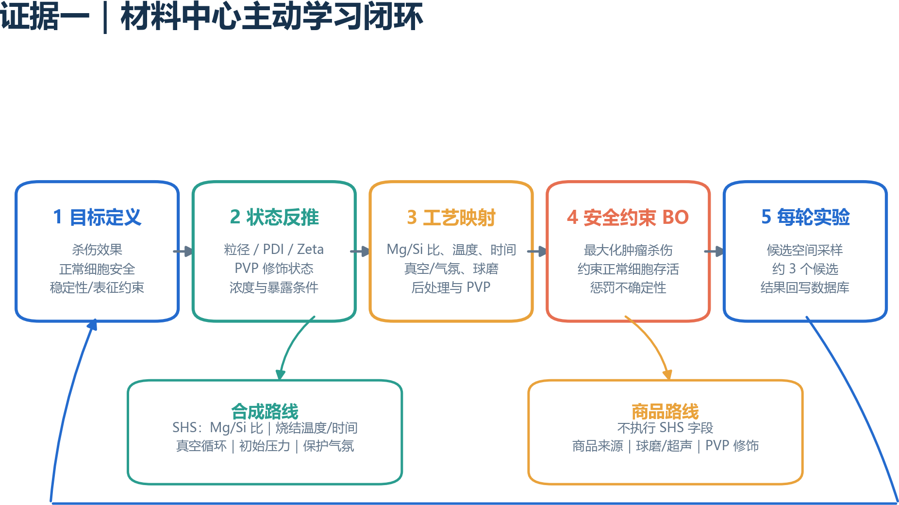
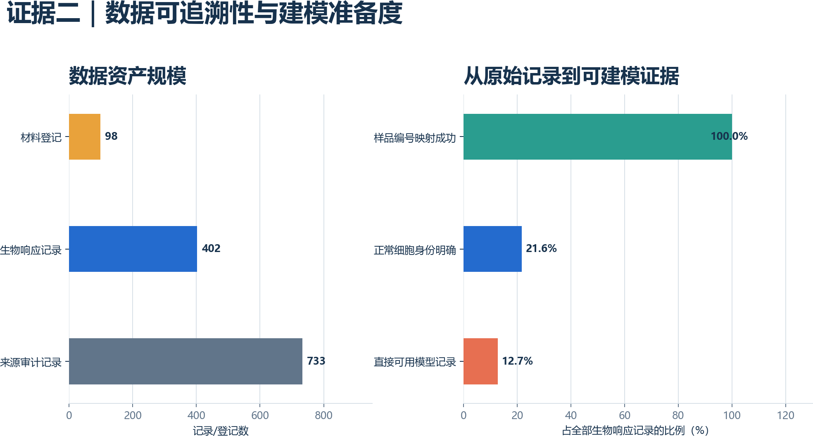
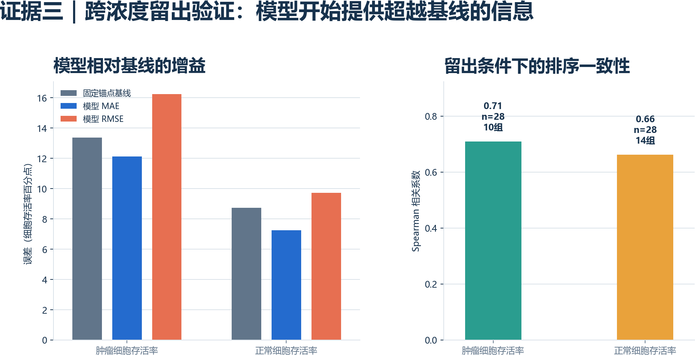
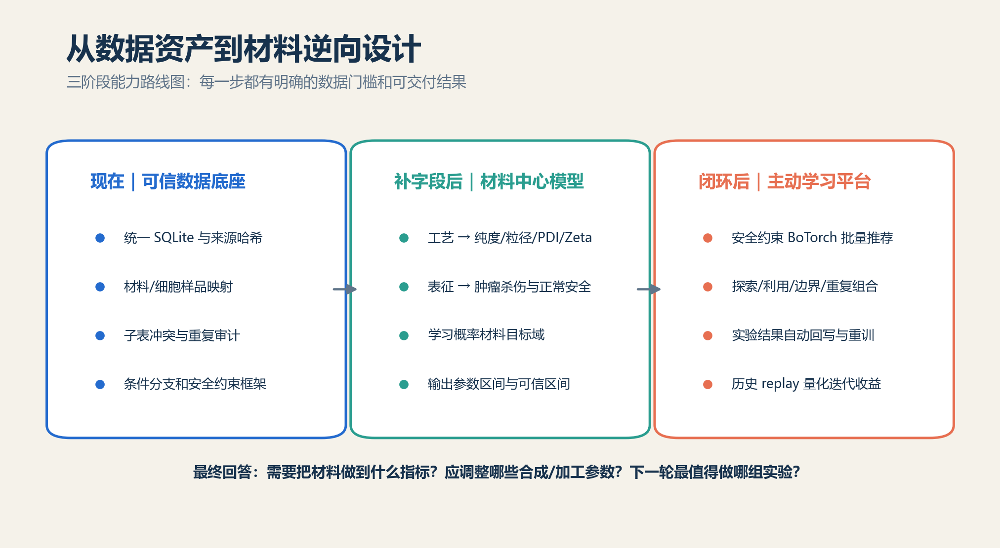
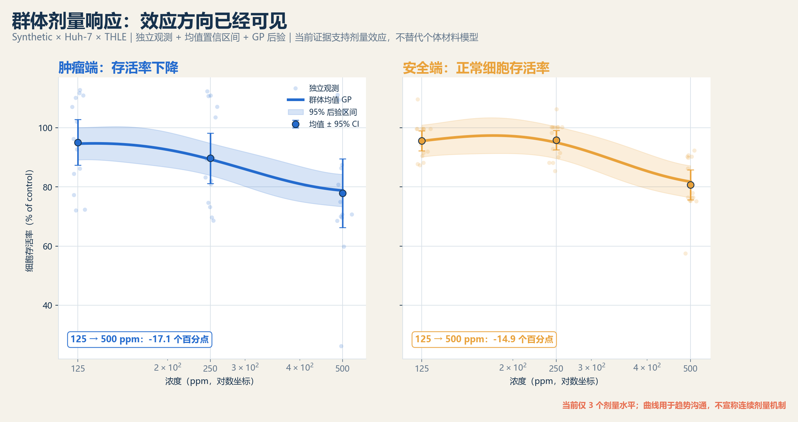
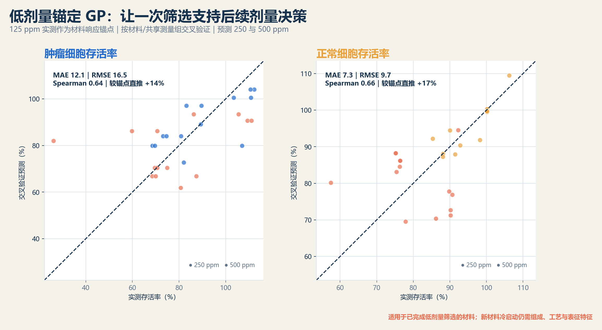
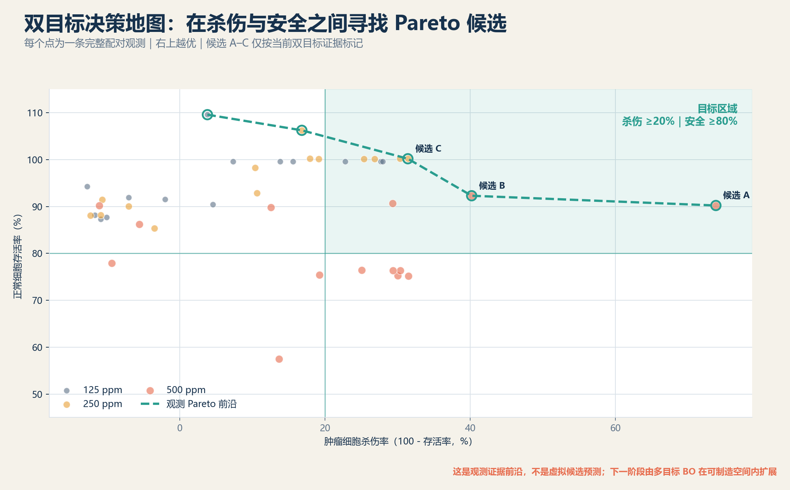

# Mg2Si 材料中心主动学习：汇报提纲

## 一句话主旨

把现有“材料合成、材料表征和细胞实验”从分散记录升级为可持续学习的科研闭环，让系统回答三件事：

1. 为达到目标肿瘤杀伤和正常细胞安全性，材料需要进入什么表征区间？
2. 为实现这些材料指标，Mg/Si、SHS、真空、球磨和表面修饰参数应该向什么方向调整？
3. 下一轮有限实验预算最值得验证哪些候选？

## 现在已经完成

- 两个原始工作簿及全部子表进入统一 SQLite 数据库。
- 材料、工艺、表征、细胞实验和样品映射具有来源追溯。
- 合成原料和商品原料使用不同的条件设计空间。
- 正常细胞安全性作为概率约束，不被综合评分掩盖。
- BoTorch 连续候选、分组验证和实验建议角色已经形成代码闭环。

## 当前数据给出的诚实结论

- 402 个浓度响应点中，正常细胞身份明确的占 21.6%。
- 材料映射覆盖率为 38.1%。
- 核心材料表征尚未形成有效覆盖。
- 当前过渡基线对肿瘤存活率的 MAE 为 15.7 个百分点，正常细胞存活率 MAE 为 7.1 个百分点。
- 当前四个候选预测不能被模型有效区分，因此尚不能作为正式实验处方。
- 当前 42 条完整范围内只有浓度具备 3 个有效水平；Mg/Si、SHS 温度、保温、压力和球磨参数都只有一个有效水平，暂时无法拟合可信的工艺响应曲面。

## 下午补字段后的直接收益

- 可以训练 `process -> characterization` 模型，量化 SHS、真空和球磨对材料状态的影响。
- 可以训练 `characterization -> biology` 模型，学习粒径、PDI、Zeta、纯度和表面状态对应的杀伤—安全窗口。
- 可以输出“概率材料目标域”，而不是照搬文献阈值。
- 可以让候选真正因工艺差异产生不同预测和不确定性。

## 建议汇报表达

可以说：

> 我们已经完成数据底座和主动学习框架，下一阶段不是继续堆算法，而是补齐关键材料表征和实验身份字段。一旦这些字段进入数据库，系统就能从“预测生物性能”升级为“反推材料指标与制备参数”。

不建议说：

> 模型已经证明某个温度、粒径或 Mg/Si 比一定最优。

当前证据只支持提出下一轮验证方向，不支持因果或安全结论。

## 图表

讲解口径：当前三档剂量已经显示出可沟通的群体趋势；阴影是均值趋势的不确定性，而不是对每个新材料的精确保证。

讲解口径：完全未知材料仅靠浓度无法区分，不能硬做高精度预测。更合理的近期落地方案是先做一次 125 ppm 低成本筛选，把该响应作为材料锚点，再预测 250/500 ppm，减少后续实验组合。

讲解口径：平台不是只追求更强杀伤，而是在肿瘤杀伤和正常细胞安全之间寻找 Pareto 候选。当前前沿来自真实配对观测；补齐 Mg/Si、合成温度、压力、球磨与表征字段后，多目标 BO 将从“筛选已有材料”升级为“反向推荐可制造工艺”。
